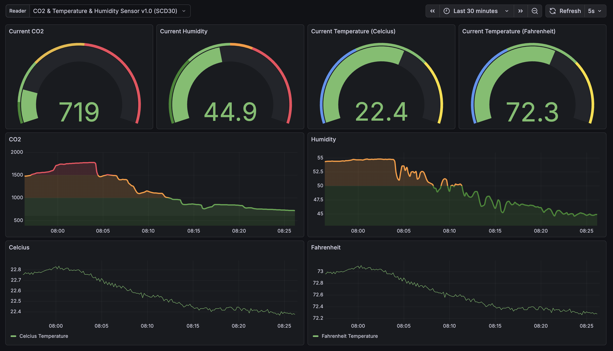

<div align='center'>
 <h1>
  ipro: Indoor Climate Project
 </h1>
 
 <!--<p>
  <a href="https://github.com/badges/shields/actions/workflows/daily-tests.yml">
    
  </a>
  <a href="https://coveralls.io/github/badges/shields">
    </a>
 </p>-->

 <kbd></kbd>

 <p>
  This repository contains the code and resources for the Indoor Climate Project (ipro).
 </p>

 <p>
  Check the <a href='#'>Demo</a> (planned).
 </p>

 <h2>Technologies Used</h2>

 <h4>Programming Languages & Frameworks</h4>

 <p>
  <a href="https://www.python.org/"></a>
  <a href="https://micropython.org/"></a>
  <a href="https://docs.docker.com/compose/"></a>
 </p>

 <h4>Visualisation</h4>

 <p>
  <a href="https://grafana.com/"></a>
 </p>

 <h4>Database & ORM</h4>

 <p>
  <a href="https://www.tigerdata.com/timescaledb"></a>
  <a href="https://www.postgresql.org/"></a>
  <a href="https://alembic.sqlalchemy.org/en/latest/"></a>
 </p>

 <h4>Networking & Data Handling</h4>
 
 <p>
  <a href="https://tailscale.com"></a>
  <a href="https://mosquitto.org/"></a>
  <a href="https://www.influxdata.com/time-series-platform/telegraf/"></a>
 </p>

 <h4>Hardware Platforms</h4>

 <p>
  <a href="https://adafru.it"></a>
  <a href="https://raspberrypi.org/"></a>
  <a href="https://microbit.org/"></a>
 </p>

<!-- Adding this later when using Raspberry Pi 3 B+ or Tuino 1
 <p>
  <a href="https://raspberrypi.org/"></a>
  <a href="https://arduino.cc/"></a>
 </p>
-->

</div>

<br />


# Repository Structure

The repository is organized into several key directories:
- `project/`: Contains the main project code and documentation.
    - `docs/`: Contains documentation related to the project.
    - `firmware/`: Contains the micro:bit firmware code.
    - `migrations/`: Contains Alembic database migration scripts.
    - `src/`: Contains the source code for the data logger and database interactions.
        - `database/`: Contains database connection and model definitions.
        - `monitoring/`: Contains grafana dasboard configurations.
        - `utils/`: Contains utility functions such as the serial reader.
- `templates/`: Contains template repositories 
    - `fhnw-ipro-indoor-climate-genavi/`: Template for the indoor climate project (GitHub).
    - `ipro_strat_hs25/`: Template for ipro project (FHNW GitLab).

Both projects `template-indoor-climate-genavi` and `ipro_strat_hs25` are set up as submodules within this repository. In order to work with them, you need to initialize and update the submodules after cloning the main repository. (Not needed to run the Indoor Climate Project itself)

```console
$ git clone <repository_url>
$ cd <repository_directory>
$ git submodule update --init --recursive
```

# Getting started

The [getting-started.md](project/docs/getting-started.md) file provides detailed instructions on setting up the development environment for the Indoor Climate Project.

# Roadmap and Project Log
Check the [project.md | Project Plan](project/docs/0-project/project.md#project-plan) for an overview of the project timeline, milestones, and levels.

Progress and updates are documented in the [project.md | Project Log](project/docs/0-project/project.md#project-log).

# License
TBD