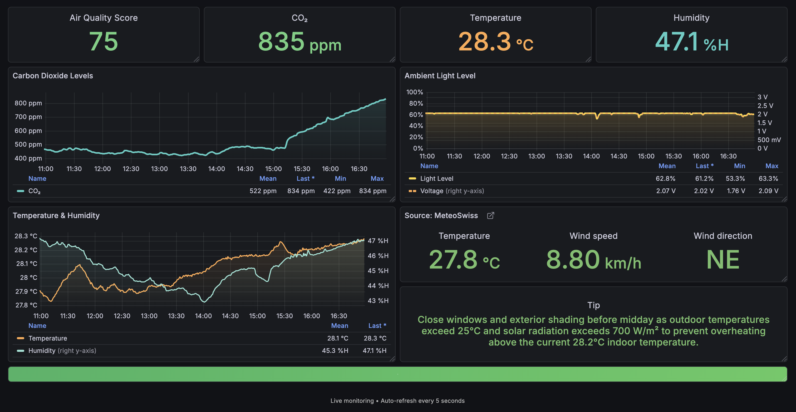

<div align='center'>
  <h1>
    ipro: Indoor Climate Project
  </h1>
  
  <!--<p>
    <a href="https://github.com/badges/shields/actions/workflows/daily-tests.yml">
      
    </a>
    <a href="https://coveralls.io/github/badges/shields">
      </a>
  </p>-->

  <kbd></kbd>

  <p>A real-time indoor climate monitoring system that tracks CO₂ levels, temperature, humidity, and ambient light. Data is collected from ESP32-S3 sensors and visualized through modern Grafana dashboards optimized for Desktop and iPad displays.</p>

  <p><strong>Live Monitoring:</strong> Auto-refreshing dashboards with air quality scoring, threshold alerts, and dual-axis sensor visualization.</p>
  <p><strong>Local Weather Station Data:</strong> MeteoSwiss API integration for fetching data from local weather stations.</p>
  <p><strong>AI Integration:</strong> Utilizes the Gemini AI agent for predictive analytics and recommendations based on historical and real-time data.</p>

  <h2>Technologies Used</h2>

  <h4>Programming Languages & Frameworks</h4>
  <a href="https://www.python.org/"></a>
  <a href="https://micropython.org/"></a>
  <a href="https://docs.docker.com/compose/"></a>

  <h4>Visualisation</h4>
  <a href="https://grafana.com/"></a>

  <h4>AI Integration</h4>
  <a href="https://gemini.com/"></a>

  <h4>Database & ORM</h4>
  <a href="https://www.tigerdata.com/timescaledb"></a>
  <a href="https://www.postgresql.org/"></a>
  <a href="https://alembic.sqlalchemy.org/en/latest/"></a>

  <h4>Networking & Data Handling</h4>
  <a href="https://tailscale.com"></a>
  <a href="https://mosquitto.org/"></a>
  <a href="https://www.influxdata.com/time-series-platform/telegraf/"></a>

  <h4>Hardware Platforms</h4>
  <a href="https://adafru.it"></a>
  <a href="https://raspberrypi.org/"></a>
  <a href="https://microbit.org/"></a>

</div>

<hr />

# Repository Structure

The repository is organized into several key directories:

```
project/
├── database/                               # Contains database connection and model definitions.
├── docs/                                   # Contains documentation related to the project.
├── firmware/                               # Contains the micro:bit firmware code.
├── migrations/                             # Contains Alembic database migration scripts.
├── monitoring/                             # Contains grafana dasboard configurations.
├── mosquitto/                              # Contains mosquitto configuration files.
└── src/                                    # Contains the source code for the data logger and database interactions.
    ├── climate_advisor/                    # Contains the climate advisor code.
    ├── fetch_meteoswiss_data/              # Contains code to fetch data from MeteoSwiss.
    └── raspberry_py_script/                # Contains the Raspberry Pi code to fetch data from ESP32.
templates/ 
    ├── fhnw-ipro-indoor-climate-genavi/    # Template for the indoor climate project (GitHub).
    └── ipro_strat_hs25/                    # Template for ipro project (FHNW GitLab).
```

Both projects `template-indoor-climate-genavi` and `ipro_strat_hs25` are set up as submodules within this repository. In order to work with them, you need to initialize and update the submodules after cloning the main repository. (Not needed to run the Indoor Climate Project itself)

```console
$ git clone <repository_url>
$ cd <repository_directory>
$ git submodule update --init --recursive
```

# Getting started

The [getting-started.md](project/docs/getting-started.md) file provides detailed instructions on setting up the development environment for the Indoor Climate Project.

# Roadmap and Project Log
Check the [project.md | Project Plan](project/docs/0-project/project.md#part-one) for an overview of the project timeline and milestones.

Progress and updates are documented in the [project.md | Project Log](project/docs/0-project/project.md#project-log).

# License
TBD