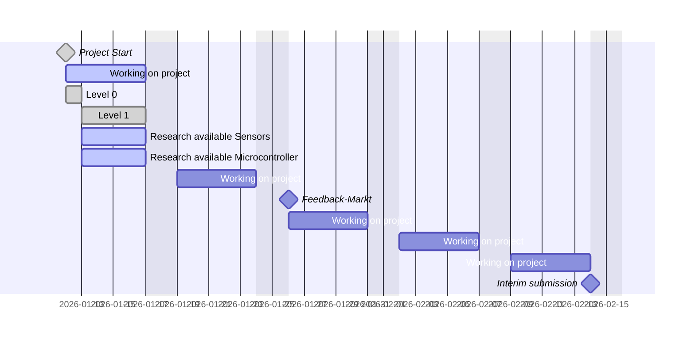

# Project Plan - Variant: Long

## Project Levels
- [Level 0](../../../templates/fhnw-ipro-indoor-climate-genavi/level-0/README.md#building-blocks)
- [Level 1](../../../templates/fhnw-ipro-indoor-climate-genavi/level-1/README.md#building-blocks)
- [Level 2](../../../templates/fhnw-ipro-indoor-climate-genavi/level-2/README.md#building-blocks)
- [Level 3](../../../templates/fhnw-ipro-indoor-climate-genavi/level-3/README.md#building-blocks)
- [Level 4](../../../templates/fhnw-ipro-indoor-climate-genavi/level-4/README.md#building-blocks)

## Research available Microcontroller and Sensors
- [Personal Hardware](../2-hardware/personal-hardware.md)
