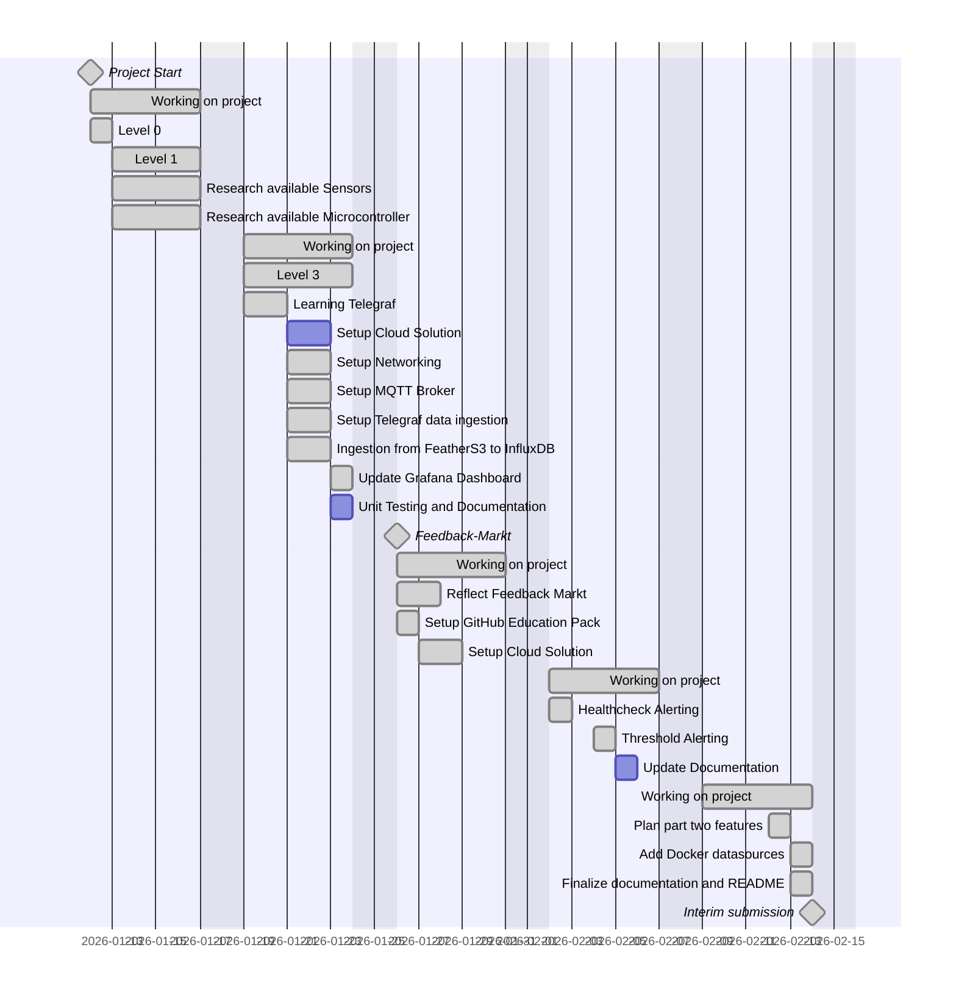
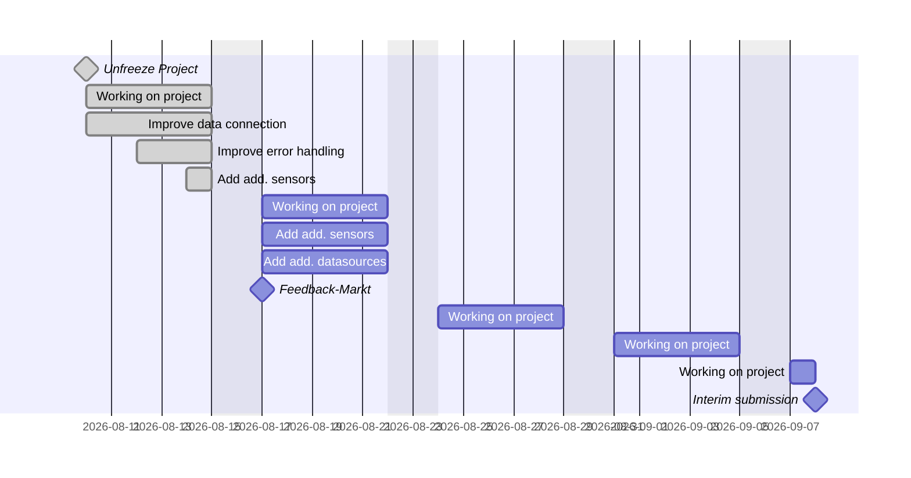
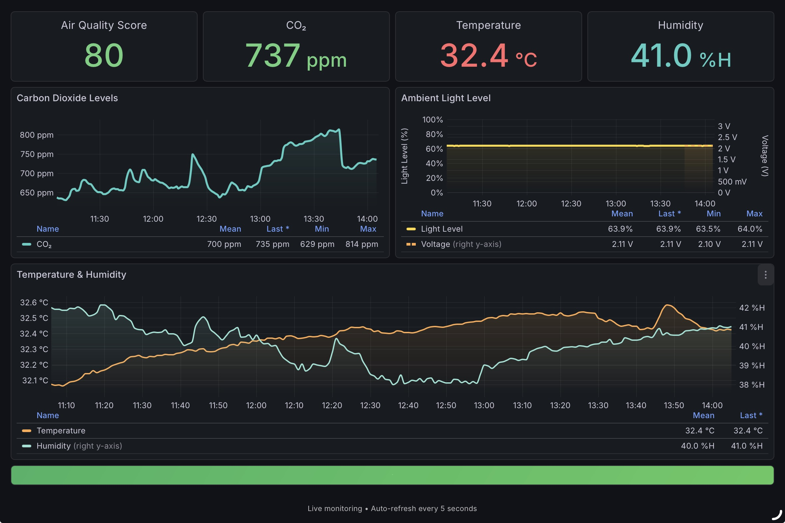

# Project Plan - Variant: Long

### Part One


### Part Two


## Project Levels
- [Level 0](../../../templates/fhnw-ipro-indoor-climate-genavi/level-0/README.md#building-blocks)
- [Level 1](../../../templates/fhnw-ipro-indoor-climate-genavi/level-1/README.md#building-blocks)
- [Level 2](../../../templates/fhnw-ipro-indoor-climate-genavi/level-2/README.md#building-blocks)
- [Level 3](../../../templates/fhnw-ipro-indoor-climate-genavi/level-3/README.md#building-blocks)
- [Level 4](../../../templates/fhnw-ipro-indoor-climate-genavi/level-4/README.md#building-blocks)


## Research available Microcontroller and Sensors
- [Personal Hardware](../2-hardware/personal-hardware.md)


# Project Log

## Week of 10 August 2026

### Tasks:
- Project
    - [x]  Plan additional features for part two of the project
    - [x]  Improve data connection on Raspberry Pi and FeatherS3 devices to ensure reliable data transmission to the MQTT broker
    - [x]  Improve error handling in the data collection and transmission process
    - [x]  Add an additional sensors (eg. for the Window state (open/closed), light intensity, and motion detection) and display it on the dashboard


### 16 August 2026

> Added Grove Light Sensor v1.1 by Seeed to the FeatherS3 hardware setup to measure ambient light levels. Updated the firmware to v5 to read light sensor data via analog pin A0 and convert it to voltage and percentage. The sensor data is now published alongside CO2, temperature, and humidity readings.
>
> Created a Grafana dashboard specifically for the iPad layout:
>
>  <kbd></kbd>
>
> Resources:
> - Grove Shield for FeatherS3: https://www.seeedstudio.com/Grove-Shield-for-Particle-Mesh-p-4080.html
> - Voltage calculation for light sensor: 
>   - https://docs.circuitpython.org/en/latest/shared-bindings/analogio/index.html
>   - https://learn.adafruit.com/circuitpython-essentials/circuitpython-analog-in


### 14 August 2026

> A big problem I had was that my python script would crash silently. For example, if the MQTT client could not connect to the broker, the script would crash without any error message. I added a lot of logging to the script, so that I can see what is happening and where the script is failing. I also added a retry mechanism for the MQTT client connection, so that it will keep trying to connect to the broker until it succeeds. 
>
> - Structured logging at INFO level with timestamps
> - Environment validation before attempting connections
> - Graceful shutdown handling (SIGINT/KeyboardInterrupt)
> - Detailed error messages with stack traces for debugging
> - Proper exit codes (0 for success, 1 for errors)
>
> To make sure the script validates configuration before attempting connections, I added a function that checks if all required environment variables are set and valid. 
> - Conditional validation: Only validates database vars if OUTPUT_METHOD=database
> - Clear error messages: Describes each missing variable's purpose
> - Password masking: Logs variable names but masks password values
> - Network checking: check_network_connectivity() tests DNS resolution

> For the data collection I still had the old column based schema in `utils/database.py`. In alemic I already had a new schema with a more flexible table structre. I updated the `utils/database.py` to use the new schema.
>
> Old Schema:
> ```
> timestamp, reader, location, 
> sensor_0_name, sensor_0_value,
> sensor_1_name, sensor_1_value, ...
> ```
>
> New Schema:
> ```
> time, reader, location, topic, sensor_type, value, unit
> ```
> Added new function `save_multiple_readings`and updated `save_to_database` to handle the new schema and save multiple readings at once. This allows for more flexibility in the types of sensors and readings that can be stored in the database, as well as easier querying and analysis of the data.


### 13 August 2026

> Added comprehensive system metrics collection:
> 
> System Metrics:
> - CPU (per-core and total usage)
> - Memory (usage %, cache, buffers, swap, active/inactive)
> - Disk (usage by mount point)
> - Network (traffic by interface)
> - System load and uptime
> 
> Docker Container Metrics:
> - Container CPU usage
> - Container memory usage
> - Container network I/O
> - Container block I/O (available but not yet visualized)
> 
> PostgreSQL Output Enhancement:
> - Auto-creates tables for all metrics
> - Automatically converts tables to TimescaleDB hypertables with 1-day - > chunk intervals
> - Tables created: cpu, mem, disk, net, system, docker_container_*
> 
> ```ini
> # telegraf.conf
> [[outputs.postgresql]]
>   create_templates = [
>     '''CREATE TABLE IF NOT EXISTS {{.table}} ({{.columns}})''',
>     '''SELECT create_hypertable({{.table|quoteLiteral}}, 'time', chunk_time_interval => INTERVAL '1 day', if_not_exists => TRUE)''',
>   ]
> ```

> Raspberry Pi MQTT connections timing out, packets not being forwarded through Tailscale VPN.
>
> Root Cause: Tailscale container running in userspace networking mode with network_mode: host doesn't create the tailscale0 network interface, causing packet forwarding to fail.
>
> Solution:
> - Added TS_USERSPACE=false environment variable to force kernel networking mode
> - Verified tailscale0 interface creation with proper IP assignment (100.109.73.83)
> - This enables proper packet forwarding from Raspberry Pi (100.92.211.120) to Mosquitto
>
> ```ini
> # docker-compose.yml - tailscale service
> environment:
>   - TS_USERSPACE=false  # Force kernel mode networking
> ```
>
> - Ensures Mosquitto listens on all container interfaces, allowing Docker port forwarding to work
> - Required for Tailscale VPN traffic to reach the broker
> - Security maintained via authentication (`allow_anonymous false`) and DigitalOcean firewall rules

### 12 August 2026
> I found that the MQTT client is failing to connect, because it can't resolve the hostname `iot-gateway`. The error `socket.gaierror: [Errno -2] Name or service not known` showed me the DNS lookup failed because the Raspberry Pi was not connected to the Tailscale network. I created an additional systemd service that starts Tailscale on boot. This way, the Raspberry Pi will automatically connect to the Tailscale network when it boots up, ensuring that the MQTT client can resolve the hostname and connect to the broker. To keep the Auth Key secure and easy to maintain, I created a file `/etc/tailscale/authkey` and added the Auth Key to that file. The systemd service reads the Auth Key from that file when starting Tailscale. I use the `--reset` tag to ensure that the Tailscale connection is reset and re-established on each boot, which helps to avoid any potential issues with stale connections or cached DNS entries. I also added the `--accept-routes` tag to allow the Raspberry Pi to accept routes from other devices on the Tailscale network, which is necessary for proper communication with the MQTT broker.
> ```bash
> [Unit]
> Description=Tailscale Auto Connect
> After=network-online.target tailscaled.service
> Wants=network-online.target
> Requires=tailscaled.service
> 
> [Service]
> Type=oneshot
> ExecStart=/bin/sh -c 'tailscale up --authkey=$(cat /etc/tailscale/authkey) --reset --accept-routes'
> RemainAfterExit=yes
> 
> [Install]
> WantedBy=multi-user.target
> ```

### 11 August 2026
> I started analyzing the data connection on the Raspberry Pi and FeatherS3 devices to ensure reliable data transmission to the MQTT broker. I ran into multiple problems where the connection would drop unexpectedly.
>
> I was using an outdated way to connect to the broker, which was causing the connection to drop. I updated the code to use Version 2 of the MQTT client library and implemented a more robust connection handling mechanism. This should help improve the reliability of the data transmission from the Raspberry Pi and FeatherS3 devices to the MQTT broker.

> #### Original:
> ```python 
> ./src/main.py
>
> import os
> import serial
> import paho.mqtt.client as mqtt
> from dotenv import load_dotenv
> 
> from src.utils.serial_reader import start_reading
> from src.utils.database import run_migrations
> 
> ser = serial.Serial(os.getenv('SERIAL_PORT'), int(os.getenv('BAUDRATE')))
> 
> client = mqtt.Client()
> client.username_pw_set(os.getenv('MQTT_USERNAME'), os.getenv('MQTT_PASSWORD'))
> client.connect(os.getenv('MQTT_BROKER'), int(os.getenv('MQTT_PORT')), 60)
> 
> def main():
>     load_dotenv()
>     if os.getenv("OUTPUT_METHOD") == "database":
>         run_migrations()
>     start_reading(os.getenv("SERIAL_PORT"), os.getenv("BAUDRATE"), os.getenv("OUTPUT_METHOD"), client)
> 
> if __name__ == "__main__":
>     main()
> ```
> 
> #### Updated:
> ```python 
> ./src/main.py
>
> ...
> + from paho.mqtt.enums import CallbackAPIVersion
> ...
> - client = mwtt.Client()
> + client = mqtt.Client(CallbackAPIVersion.VERSION2)
> ...
> ```

> Then I found out that the loading of the script causes it to crash aswell. Right now the script tries to read the serial port and connect to the MQTT broker at the very top of the file, before `load_dotenv()` has a chance to run. This is why I moved `load_dotenv()` to the very top of the file, so that the environment variables are loaded before any other code is executed.
>
> #### Final:
> ```python 
> ./src/main.py
>
> import os
> import serial
> import paho.mqtt.client as mqtt
> from dotenv import load_dotenv
> from paho.mqtt.enums import CallbackAPIVersion
> 
> from src.utils.serial_reader import start_reading
> from src.utils.database import run_migrations
> 
> load_dotenv()
> 
> ser = serial.Serial(os.getenv('SERIAL_PORT'), int(os.getenv('BAUDRATE')))
> 
> client = mqtt.Client(CallbackAPIVersion.VERSION2)
> client.username_pw_set(os.getenv('MQTT_USERNAME'), os.getenv('MQTT_PASSWORD'))
> client.connect(os.getenv('MQTT_BROKER'), int(os.getenv('MQTT_PORT')), 60)
> 
> def main():
>     if os.getenv("OUTPUT_METHOD") == "database":
>         run_migrations()
>     start_reading(os.getenv("SERIAL_PORT"), os.getenv("BAUDRATE"), os.getenv("OUTPUT_METHOD"), client)
> 
> if __name__ == "__main__":
>     main()
> ```

### 10 August 2026
> Started planning additional features for part two of the project. 
>
> I will focus on improving the data connection on the Raspberry Pi and FeatherS3 devices to ensure reliable data transmission to the MQTT broker. During the intermission, I ran into multiple problems where the connection would drop unexpectedly.
>
> Additionally, I explored adding additional datasources for the Grafana dashboard, such as weather data and container metrics, as well as adding an additional sensor for monitoring the window state (open/closed) and displaying it on the dashboard.
> - MeteoSwiss ICON CH in an opend data weather forcasts from MeteoSwiss (https://open-meteo.com/en/docs/meteoswiss-api?hourly=&latitude=47.4009356&longitude=7.9712697&timezone=Europe%2FBerlin&daily=temperature_2m_max,temperature_2m_min,sunrise,sunset,weather_code) 

## Final state Part One
### Overview
The Indoor Climate Project is an IoT application designed to monitor and visualize indoor climate conditions using various sensors and a microcontroller. The project consists of several components, including hardware for data collection, a cloud solution for data storage and visualization, and secure networking for communication between the components. The main features of the project include:
- Real-time monitoring of indoor climate conditions (temperature, humidity, CO2 levels) using FeatherS3 sensors.
- Data storage in a TimescaleDB database hosted on a DigitalOcean Droplet.
- Visualization of the sensor data using Grafana dashboards.
- Visualization of Docker Container metrics on the Grafana dashboard.
- Alerting from Grafana to Google Chat for threshold breaches and healthcheck monitoring.

### Sensors
- FeatherS3 (Adafruit Feather S3) with sensor for measuring temperature, humidity, CO2 levels.

### Microcontroller
- FeatherS3 (Adafruit Feather S3) as the main microcontroller to read data from the sensors and send it to the database.
- Raspberry Pi 3 B+ as a gateway device to read data from the FeatherS3 and send it to the MQTT broker.

### Cloud Solution
- DigitalOcean Droplet for hosting the production environment, including the database and Grafana dashboard.

### Database and Visualization
- TimescaleDB for storing the sensor data.
- Grafana for visualizing the sensor data and creating dashboards.
- Telegraf for collecting data from the MQTT broker and sending it to TimescaleDB.
- Mosquitto MQTT Broker for receiving data from the FeatherS3 and allowing Telegraf to consume it.
- Tailscale for secure networking and remote access to the application.


## Week of 09 February 2026

### Tasks:
- Project
    - [x]  Finalize project and prepare for interim submission
    - [x]  Plan additional features for part two of the project
    - [x]  Add docker container datasource to Grafana dashboard (e.g., container metrics)
    - [ ]  ~~Add additional datasources to the Grafana dashboard (e.g., weather data, container metrics)~~ // feature for part two
    - [ ]  ~~Add an additional sensor for the Window state (open/closed) and display it on the dashboard~~ // feature for part two

### 13 February 2026
> Was able to use Telegraf plugin to collect Docker container metrics and display them on the Grafana dashboard. This allows me to monitor the performance and resource usage of the Docker containers running the application, which can be useful for troubleshooting and optimizing the application as it scales.

> Added deployment instructions for the production environment in the [Deployment Guide](deployment.md) and updated the [Getting Started Guide](getting-started.md) with instructions for setting up the development environment and running the application locally using Docker Compose.

> Setup an automation script on Raspberry Pi to start reading as soon as the Raspberry Pi boots up is connected the the Home Wifi network. This way I can ensure that the data collection from the FeatherS3 sensor starts automatically without needing to manually start the script every time.

### 12 February 2026
> Planned possible features for part two of the project in the [plan-part-two.md](plan-part-two.md) document. These features include adding additional datasources to the Grafana dashboard, adding an additional sensor for the Window state, implementing threshold alerting in Grafana, and implementing healthcheck alerting for the FeatherS3 connection. I will prioritize these features based on user feedback and the overall goals of the project.

## Week of 02 February 2026

### Tasks:
- Project
    - [x]  Add threshold alerting to the Grafana dashboard for when certain thresholds are exceeded (e.g., CO2 levels too high)
    - [x]  Add healthcheck alerting to the Grafana dashboard to monitor the status of the FeatherS3 connection
    - [ ]  ~~Update documentation with new Grafana dashboard features and alerting setup~~

### 04 February 2026
> Added threshold alerting to the Grafana dashboard for when thresholds are exceeded for CO2 levels and Humidity. The alerts trigger when the CO2 levels exceed 1000 ppm or the Humidity levels exceed 50%H. This is a common threshold for indoor air quality, where levels above 1000 ppm can indicate poor ventilation and potential health issues.
> Setup another Google Chat room "Indoor Climate Alerting" and added a webhook integration to receive the Grafana alerts in the chat room. This way I know immediately when I have to do a proper "stosslüften" in order to lower the CO2 and Humidity levels.

### 02 February 2026
> Added alerting for the healthcheck, I set up an alert that triggers when no new data is received from the FeatherS3 for than 1 minute (should usually send data every five seconds).
> Setup Google Chat room "Indoor Climate Alerting (Administration)" and added a webhook integration to receive the Grafana alerts in the chat room. This way I can react fast when there is an issue with the data collection.

## Week of 26 January 2026

### Tasks:
- Project
    - [x]  Continue working on project based on feedback from feedback market
    - [x]  Setup GitHub Education Pack for free cloud hosting credits
    - [x]  Research and plan cloud deployment as a DigitalOcean Droplet
    - [x]  Implement cloud deployment using Docker Compose on DigitalOcean Droplet
    - [x]  Update documentation with cloud deployment instructions

### 27 January 2026
> Set up a DigitalOcean account and claimed the $200 credit for students from the GitHub Education Pack. I will use this credit to host my application in the cloud for free during the development phase and potentially even after the project is completed if the credit lasts long enough.
> Started researching how to deploy my application using Docker Compose on a DigitalOcean Droplet. I documented how I creates and configures a Droplet for hosting the production environment in [DigitalOcean Setup](../digitalocean-setup.md). After setting up the Droplet, I deployed my application using Docker Compose.
> For the environment variables, I first tried to exchange the `.env` with [Docker Secrets](https://docs.docker.com/engine/swarm/secrets/) but hat to switch back, because I kept getting into problems, where the docker containers could not properly read the secrets. So I went back and used the same `.env` file that I use for local development and uploaded it to the Droplet.

### 26 January 2026
> Feedback market went well. Got some good feedback on the project and some ideas for improvement. I will continue working on the project based on the feedback and try to implement some of the suggested improvements.
> - Idea: Add alerting to the Grafana dashboard for when certain thresholds are exceeded (e.g., CO2 levels too high).
> - Idea: Add more sensors and display their data on the dashboard (e.g., Window sensors).
> - Idea: Implement a mobile app for remote monitoring of the indoor climate data.
> - Idea: Add external data sources like weather data to the dashboard for correlation analysis.
> - Idea: Add container data to the dashboard to monitor the status of the Docker containers (e.g., CPU and memory usage).

## Week of 19 January 2026

### Tasks:
- Learning Iot basics
    - [x]  Finish level 3 tasks
- Learn Telegraf with [InfluxDB University](https://university.influxdata.com/):
    - [x]  Complete "Telegraf Basics" course
    - [ ]  ~~Complete "Data Collection with Telegraf" course~~ -> primarily focused on InfluxDB
    - [x]  Complete "Telegraf Administrator" course
- Project
    - [x]  Learn about Telegraf Basics and Data Collection
    - [ ]  Set up Cloud Solution for Data Storage and Visualization -> Delayed due to Oracle Cloud Free Tier account approval pending
    - [x]  Set up secure networking with Tailscale
    - [x]  Set up Mosquitto MQTT Broker
    - [x]  Set up Telegraf to read data from FeatherS3 via MQTT/~~SNMP/HTTP~~
    - [x]  Implement data ingestion from FeatherS3 to TimescaleDB
    - [x]  Update Grafana dashboard to include FeatherS3 data
    - [ ]  Create unit tests for data ingestion and visualization components

### 25 January 2026
> Made sure to have a local running solution, in order to properly present the project in the feedback market on Monday, even though my Oracle Cloud Free Tier account is still pending approval. I can easily migrate the solution to the cloud later on when the account is approved.
> For the Data ingestion from FeatherS3 to TimescaleDB, I decided to use MQTT as the communication protocol between FeatherS3 and Telegraf. Unfortunately, I had to find out that my plan, to connect the FeatherS3 directly to Telegraf is not possible. As a workaround for now and for the presentation I decided to connect the FeatherS3 to my Raspberry Pi and set up Tailscale on the Raspberry Pi to read the data from the serial USB port and send it to the MQTT broker running in Docker on my Macbook. The Raspberry Pi will be connected to my Hotspot network, so that it can communicate with the MQTT broker.

### 23 January 2026
> The Oracle Cloud Free Tier account is still in the process of being approved. So for now I will continue developing and testing the project locally using Docker Compose.
>
> Started configuring my communication setup
>
> ``FeatherS3 --(mqtt)--> Mosquitto -> Telegraf -> TimescaleDB -> Grafana``
>
> **Tailscale Setup**
> 1. The IoT devices connect over the Tailscale mesh network to the Mosquitto MQTT broker.
> 2. The MQTT broker uses the Tailscale Sidecar pattern `network_mode: "service:tailscale"`.
> 3. Telegraf connects to Mosquitto via Tailscale MagicDNS from the Docker network.
> 4. TimescaleDB and Grafana remain on the Docker network for internal communication.
> 5. I expose Grafana on port 3000 on the host, local network `<colima-gateway-ip>:3000`, and via Tailscale serve I can connect Grafana with Tailscale serve over `https://iot-gateway.tail7a645b.ts.net` if I'm connected to the Tailscale mesh. It runs in the background of the Tailscale container using `tailscale serve --https=443 http://grafana:3000`.
>       - With Tailscale serve, I can access Grafana securely over HTTPS without exposing it directly to the public internet.
>       - With `docker exec tailscale tailscale serve status`, I can see the status of the Tailscale serve.
>           ```console
>           $ docker exec tailscale tailscale serve status                              
>           https://iot-gateway.tail7a645b.ts.net (tailnet only)
>           |-- / proxy http://grafana:3000
>           ```
>
> **Reasoning**
> - MQTT broker not exposed on public ports, only accessible through Tailscale mesh
> - All IoT device traffic encrypted via Tailscale VPN
> - Database remains isolated on Docker network
>
> For setup Tailscale properly, I'm following the Tailscale Docker setup guide [Using Tailscale with Docker](https://tailscale.com/kb/1282/docker) and Blog Post [Contain your excitement: A deep dive into using Tailscale with Docker](https://tailscale.com/blog/docker-tailscale-guide),
>

> Updated my database sensor_readings table to a more generic schema to support multiple sensor types from FeatherS3 based on the data format sent via MQTT. Telegraf will handle and parse the incoming data to fit the database schema.
>
> Previous schema:
> ```console
>                        Table "public.sensor_readings"
>      Column     |           Type           | Collation | Nullable | Default
> ----------------+--------------------------+-----------+----------+---------
>  timestamp      | timestamp with time zone |           | not null |
>  reader         | integer                  |           |          |
>  location       | integer                  |           |          |
>  sensor_0_name  | text                     |           |          |
>  sensor_0_value | double precision         |           |          |
>  sensor_1_name  | text                     |           |          |
>  sensor_1_value | double precision         |           |          |
>  sensor_2_name  | text                     |           |          |
>  sensor_2_value | double precision         |           |          |
>  sensor_3_name  | text                     |           |          |
>  sensor_3_value | double precision         |           |          |
>  sensor_4_name  | text                     |           |          |
>  sensor_4_value | double precision         |           |          |
> Indexes:
>     "sensor_readings_pkey" PRIMARY KEY, btree ("timestamp")
> Foreign-key constraints:
>     "sensor_readings_location_fkey" FOREIGN KEY (location) REFERENCES locations(id)
>     "sensor_readings_reader_fkey" FOREIGN KEY (reader) REFERENCES readers(id)
> ```
>
> New schema:
> ```console
>                      Table "public.sensor_readings"
>    Column    |           Type           | Collation | Nullable | Default
> -------------+--------------------------+-----------+----------+---------
>  timestamp   | timestamp with time zone |           | not null |
>  reader      | integer                  |           |          |
>  location    | integer                  |           |          |
>  topic       | text                     |           |          |
>  sensor_type | text                     |           |          |
>  value       | double precision         |           |          |
>  unit        | text                     |           |          |
> Indexes:
>     "sensor_readings_pkey" PRIMARY KEY, btree ("timestamp")
> Foreign-key constraints:
>     "sensor_readings_location_fkey" FOREIGN KEY (location) REFERENCES locations(id)
>     "sensor_readings_reader_fkey" FOREIGN KEY (reader) REFERENCES readers(id)
> ```
>
> Update grafana dashboard to reflect new schema
> ```sql
> -- Latest Value Query
> SELECT
>   "timestamp",
>   sensor_type,
>   value AS "CO2"
> FROM sensor_readings
> WHERE
>   $__timeFilter("timestamp") AND 
>   reader IN ($reader_query) AND
>   sensor_type = 'co2'
> ORDER BY "timestamp" DESC
> LIMIT 1
>
> -- Time Series Query 
> SELECT
>   time_bucket('10s', "timestamp") AS "timestamp",
>   sensor_type,
>   avg(value) AS "CO2"
> FROM sensor_readings
> WHERE
>   $__timeFilter("timestamp") AND 
>   reader IN ($reader_query) AND
>   sensor_type = 'co2'
> GROUP BY 1, 2
> ORDER BY 1
> ```

> Now the following containers are running properly: Tailscale, TimescaleDB, Grafana. My next step is to get the MQTT broker to be ready.
>
> **MQTT Broker Setup**
> - For the MQTT broker to work properly I added the mosquitto.conf file with authentication settings and persistence settings.
> - Created a password file using `docker run -it --rm -v "$(pwd)/mosquitto/config:/mosquitto/config" eclipse-mosquitto \\n  mosquitto_passwd -b /mosquitto/config/pwfile <username> <password>` command to add a user for authentication.
> - After restarting the mosquitto container, I was able to check the MQTT connection using the following command:
>   ```console
>   $ docker run -it --rm --network project_iot_net eclipse-mosquitto mosquitto_pub \
>     -h iot-gateway \
>     -p 1883 \
>     -t "sensors/test" \
>     -u "<username>" \
>     -P "<password>" \
>     -m '{"reader":1,"location":1,"topic":"sensors/test","unit":"ppm","sensor_type":"co2","value":450.12345678234234}'
>   ```
>
> **Telegraf Setup**
> - Configured Telegraf to read data from Mosquitto using the MQTT Consumer input plugin.
> - Configured the MQTT Consumer plugin with Tailscale MagicDNS hostname to connect to the Mosquitto broker.
>   - I noticed Telegraf was not able to connect to Mosquitto initially. Telegraf config could not get the .env variables properly. I passed the variables directly in the telegraf.conf file to fix the issue.
> - Configured the data format as JSON to parse the incoming sensor data.
>   - Had to try a couple of approaches to get the data parsing right.
>       - telegraf ouput plugin for postgresql expected the timestamp field to be named "time" instead of "timestamp". Updated my database schema accordingly.
>       - values didn't pass because they were not formatted propperly. Used the Processor Plugin "converter" to convert the data types properly.
>           ```console
>           $ docker exec -it postgres psql -U admin -d sensor_data -c "select * from sensor_readings;"
>                        time              | reader | location |    topic     | sensor_type |       value        | unit |     host
>           -------------------------------+--------+----------+--------------+-------------+--------------------+------+--------------
>            2026-01-23 21:51:28.908198+00 |        |          | sensors/test | co2         |                450 |      | dd6579041345
>           (7 rows)
>           ```
>       - unit and topic were not passed correctly. I defined "sensory_type", "unit" and "topic" as string tags in the mqtt_consumer input plugin and in the converter processor plugin.
>           ```console
>           $ docker exec -it postgres psql -U admin -d sensor_data -c "select * from sensor_readings;"
>                        time              | reader | location |    topic     | sensor_type |       value        | unit |     host
>           -------------------------------+--------+----------+--------------+-------------+--------------------+------+--------------
>            2026-01-23 21:51:28.908198+00 |        |          | sensors/test | co2         |                450 |      | dd6579041345
>            2026-01-23 22:01:30.931239+00 |      1 |        1 | sensors/test |             |  450.1234567823423 |      | dd6579041345
>            2026-01-23 22:02:56.091213+00 |      1 |        1 | sensors/test |             |  451.1234567823423 |      | dd6579041345
>           (7 rows)
>           ```
> - Configured the output plugin to write data to TimescaleDB.
> - After restarting the Telegraf container, I checked the logs to verify that data was being ingested properly from Mosquitto to TimescaleDB.
> - Verified data ingestion by following the logs, querying the sensor_readings table in TimescaleDB and checking Grafana dashboard for incoming data points.
>   ```console
>   $ docker run -it --rm --network project_iot_net eclipse-mosquitto mosquitto_pub \
>     -h iot-gateway \
>     -p 1883 \
>     -t "sensors/test" \
>     -u "<username>" \
>     -P "<password>" \
>     -m '{"reader":1,"location":1,"topic":"sensors/test","unit":"ppm","sensor_type":"co2","value":450.12345678234234}'
>   ```
>   ```console
>   $ docker exec -it postgres psql -U admin -d sensor_data -c "select * from sensor_readings;"
>                time              | reader | location |    topic     | sensor_type |       value        | unit |     host
>   -------------------------------+--------+----------+--------------+-------------+--------------------+------+--------------
>    2026-01-23 21:51:28.908198+00 |        |          | sensors/test | co2         |                450 |      | dd6579041345
>    2026-01-23 22:01:30.931239+00 |      1 |        1 | sensors/test |             |  450.1234567823423 |      | dd6579041345
>    2026-01-23 22:02:56.091213+00 |      1 |        1 | sensors/test |             |  451.1234567823423 |      | dd6579041345
>    2026-01-23 22:06:01.268778+00 |      1 |        1 | sensors/test | co2         |  451.1234567823423 | ppm  | dd6579041345
>    2026-01-23 22:07:04.090078+00 |      1 |        1 | sensors/test | co2         |  450.1234567823423 | ppm  | dd6579041345
>    2026-01-23 22:07:25.223446+00 |      1 |        1 | sensors/test | co2         | 1450.1234567823424 | ppm  | dd6579041345
>    2026-01-23 22:07:36.145941+00 |      1 |        1 | sensors/test | co2         |  450.1234567823423 | ppm  | dd6579041345
>   (7 rows)
>   ```
> - So in the end I used three plugins. Input: mqtt_consumer, Processor: converter, Output: postgresql.


### 21 January 2026
> Asked [Gemini](https://gemini.google.com/) for assistance in finding a cheap cloud solution for hosting TimescaleDB and Grafana.
>
> Query:
> ```markdown
> I want to be able to host multiple containers using docker-compose. Including Grafana OSS, PostgreSQL (TimescaleDB), Mosquitto, Telegraf. Help me decide if I should host this in the cloud or if there is an other way. It should be free of charge. Keep in mind, that I am a Computer Science student and might have academic prices
> ```
>
> Suggested Solutions:
> ```markdown
> Hosting a stack with Grafana, TimescaleDB, Mosquitto, and Telegraf is a classic "TIG" (Telegraf, Influx/Timescale, Grafana) monitoring stack. For a computer science student, you have two primary paths: the Cloud (using student credits) or Self-Hosting (on a local server or old laptop).
> 
> Given your requirement for it to be free of charge, here is the breakdown to help you decide.
> 
> Option 1: The "Always Free" Cloud (Recommended)
> Cloud providers offer "Always Free" tiers that are perfect for lightweight Docker Compose setups. Since you are a student, you have even better access.
> 
> 1. Oracle Cloud (Best for Resources)
> Oracle Cloud is widely considered the "gold standard" for free hosting.
> 
> The Perk: Their ARM-based Ampere A1 instances provide up to 4 OCPUs and 24 GB of RAM for free.
> 
> Why it fits: TimescaleDB (PostgreSQL) can be memory-intensive. Having 24GB of RAM is massive and will easily handle your entire stack.
> 
> Catch: Availability can be tight in some regions. You may need to wait for a slot to open.
> 
> 2. GitHub Student Developer Pack (Best for Variety)
> As a CS student, you should definitely sign up for this. It bundles several offers:
> 
> DigitalOcean: Usually includes $200 in credit (valid for 1 year). You can spin up a "Droplet" (VM), install Docker, and run your stack.
> 
> Microsoft Azure for Students: $100 annual credit + many free services (B1s VMs are often free for 12 months).
> 
> Heroku: Includes credits for students, though hosting a persistent database like TimescaleDB is trickier there than on a standard VM.
> 
> Option 2: The "Old Laptop" Way (Self-Hosting)
> If you have an old laptop or a Raspberry Pi lying around, this is the most "authentic" CS experience.
> 
> Pros: Zero cost (besides a few cents of electricity), total privacy, and no "credit expiration" anxiety. It also teaches you about networking (Port Forwarding, Dynamic DNS).
> 
> Cons: If your home internet goes down, your dashboard goes down. You have to manage the hardware yourself.
>
> My Recommendation
> Start with Oracle Cloud. 1. Apply for the Oracle Cloud Always Free tier. 2. Create a VM.Standard.A1.Flex instance (ARM). 3. Install Docker and Docker Compose. 4. If Oracle is unavailable in your region, use the DigitalOcean $200 credit from the GitHub Student Pack to get running immediately.
> ```

> Created a Oracle Cloud account with the "Free Tier" option.
> -> Status: Pending approval by Oracle.
> 

> Planned project architecture with:
> - [Oracle Cloud Infrastructure (OCI)](https://www.oracle.com/cloud/free/) as cloud provider
> - [Tailscale](https://tailscale.com/) for secure networking
> - [Mosquitto](https://mosquitto.org/) as MQTT broker
> - [Telegraf](https://www.influxdata.com/time-series-platform/telegraf/) as data collector
> - [TimescaleDB](https://www.timescale.com/) (Postgres) as time-series database
> - [Grafana](https://grafana.com/) for data visualization
>
> <kbd></kbd>
>
> Miro link to the architecture diagram: [Miro - fhnw-ipro-indoor-climate](https://miro.com/app/board/uXjVGSZSySg=/?share_link_id=434076462743)
>
> <i>Icons from:</i>
> - [Laptop Icon](https://www.flaticon.com/authors/those-icons)
> - [Smartphone Icon](https://www.flaticon.com/authors/good-ware)
> - [IoT Device Icon](https://www.flaticon.com/authors/hajicon)
> - [Danger Icon](https://www.flaticon.com/authors/popcic)
> - [Security Icon](https://www.flaticon.com/authors/ilham-fitrotul-hayat)

> Started setting up [docker-compose.yml](../../docker-compose.yml) for cloud deployment based on existing local development setup.
>
> Added Tailscale, Mosquitto, Telegraf services.
> - Because Tailscale handles secure networking, I removed the exposed ports for Mosquitto, Telegraf, Postgres and Grafana.
>
> Add netork iot_net for inter-container communication
> 
> Updated volume mounts to use named volumes instead of bind mounts for persistent data storage.
> - Mosquitto data and log volumes
> - Tailscale state volume
> - Grafana data volume
> - Postgres data volume
>
> Updated Volume names to properly reflect their purpose.
> - 'pgdata' -> 'postgres_data'
> - 'grafana-storage' -> 'grafana_data'


### 20 January 2026
> Finished "Telegraf Basics" course on InfluxDB University.

> Researched Telegraf input plugins for FeatherS3 data collection:
> - MQTT Consumer Plugin
> - SNMP Input Plugin
> - HTTP Listener Plugin
> Decided to start with MQTT Consumer Plugin due to FeatherS3's built-in MQTT support.
> Learned from the documentation how to configure Telegraf with MQTT Consumer Plugin.
> ```toml
> [[inputs.mqtt_consumer]]
>   servers = ["tcp://<FEATHERS3_IP>:1883"]
>   topics = ["sensors/indoor_climate"]
>   qos = 0
>   client_id = "telegraf_feathers3_client"
>   data_format = "json"
> ```
>
> Because I decided to use MQTT as communication protocol between FeatherS3 and Telegraf, I set up Mosquitto MQTT broker using Docker.
> ```yaml
> mosquitto:
>   image: eclipse-mosquitto:latest
>   container_name: mosquitto
>   restart: unless-stopped
>   volumes:
>     - ./mosquitto/config/mosquitto.conf:/mosquitto/config/mosquitto.conf
>     - ./mosquitto/data:/mosquitto/data
>     - ./mosquitto/log:/mosquitto/log
>   networks:
>     - iot_net
> ```
>

> While browsing [dev.to](https://dev.to/) for Raspberry Pi related articles, found this great article on setting up a HomeLab Gateway with Tailscale and Raspberry Pi: [tailscale-raspberry-pi-homelab-gateway-4fin](https://dev.to/neelp03/tailscale-raspberry-pi-homelab-gateway-4fin)
>
> I like the idea of using Tailscale for secure remote access to the IoT Gateway. Might implement this in the project later on.

### 19 January 2026

> <kbd></kbd>
>
> Connected FeatherS3 to Macbook via USB-C cable
>
> Loaded SCD30 CircuitPython library onto FeatherS3
> 
> Wrote CircuitPython script to read SCD30 sensor data and output via serial
> ```python
> # CIRCUITPY/code.py
> import adafruit_scd30
> import board
> import time
> 
> sensor = adafruit_scd30.SCD30(board.I2C())
> 
> while True:
>     try:
>         co2 = sensor.CO2
>         temperature = sensor.temperature
>         fahrenheit = temperature * 9 / 5 + 32
>         celcius = temperature
>         humidity = sensor.relative_humidity
>         print(f"CO2: {co2} ppm, Temperature: {temperature} °C, {fahrenheit} °F, Humidity: {humidity} %")
>     except Exception as e:
>         print(f"Error reading sensor data: {e}")
>     time.sleep(5)
> ```
>
> Verified SCD30 sensor readings over serial using `screen`
> ```console
> $ screen /dev/tty.usbmodem4F21AF143F891 115200
> Auto-reload is on. Simply save files over USB to run them or enter REPL to disable.
> code.py output:
> Hello World!
> CO2: 1187.78 ppm, Temperature: 22.7169 °C, 72.8904 °F, Humidity: 50.7629 %
> CO2: 1187.71 ppm, Temperature: 22.7569 °C, 72.9625 °F, Humidity: 50.676 %
> CO2: 1186.65 ppm, Temperature: 22.7569 °C, 72.9625 °F, Humidity: 50.6042 %
> CO2: 1187.48 ppm, Temperature: 22.7863 °C, 73.0153 °F, Humidity: 50.5844 %
> CO2: 1187.94 ppm, Temperature: 22.7997 °C, 73.0394 °F, Humidity: 50.5402 %
> CO2: 1187.86 ppm, Temperature: 22.8424 °C, 73.1163 °F, Humidity: 50.4303 %
> CO2: 1187.77 ppm, Temperature: 22.8424 °C, 73.1163 °F, Humidity: 50.3479 %
> ...

> Started learning Telegraf with InfluxDB University. Learning path [Learnings - Telegraf](../3-learnings/telegraf.md)

## Week of 12 January 2026

### Tasks:

- Project planning
    - [x]  Prepare using ipro introduction material
- Repository setup
    - [x]  Set up repository
    - [x]  Finish level 0 tasks up to [**Use a venv virtual environment with Python**]
- Learning IoT basics
    - [x]  Finish level 0 tasks up to [**Learn how to make a prototype**]
    - [x]  Finish level 1 tasks up to [**Visualize data in a visual component**]
    - [x]  Research indoor climate sensors
    - [x]  Research microcontroller options
    - [x]  Research communication protocols

### 16 January 2026

> setup .env, docker-compose-override.yml for local development
>
> updated documentation for setting up the development environment
>
> learning to set up alembic for database migrations (reason: https://dev.to/vivekthedev/effortless-database-migrations-why-alembic-is-your-python-must-have-2f0n)
> - Tutorial to [Alembic](https://alembic.sqlalchemy.org/en/latest/tutorial.html#)
> - Documentation to [SQLAlchemy](https://docs.sqlalchemy.org/en/20/tutorial/index.html)
>
> updating project repository to a more modular structure to keep the repository from getting too cluttered

> continued working on setting up the project repository
>
> initialized alembic project
> ```console
> $ alembic init migrations
> ```
>
> created database models based on excisting database schema
>
> created initial alembic migration script to set up database schema
> ```console
> $ alembic revision --autogenerate -m "initial migration"
> $ alembic upgrade head
> ```
>
> implemented serial reader to read data from micro:bit over serial USB connection
>
> implemented data parsing and saving to TimescaleDB using SQLAlchemy ORM
>
> 

### 15 January 2026

> little personal Side-Quest:
> setup Texas Instruments MSP430 microcontroller with VSCode/PlatformIO on macOS
>
> tested OLED Display, 4-Digit Display with MSP430 board
> - had trouble getting the OLED Display to display properly.
> - found out that the library I used (U8g2) was not meant for my OLED display. Switched to U8x8 library which worked fine.
>
> wasn't able to get the 4-Digit Display to work. Suspect chip issue. Tried multiple wiring setups and different libraries without success.
> - when trying to check analog ports using a simple Button sensor script, the readings were all over the place.
> - when trying to check if the port, connected to the button, was getting power, it showed another port (not connected to anything) getting power instead.
> - when checking the pins, I noticed the GND pin was slightly nicked. Which could explain the faulty power communication.

> <kbd></kbd>
>
> setup Grafana (OSS) using docker-compose using the following resources:
> - https://grafana.com/docs/grafana/latest/setup-grafana/installation/docker/#run-grafana-via-docker-compose
> - https://grafana.com/docs/grafana/latest/setup-grafana/installation/docker/#save-your-grafana-data-1
>
> setup timescaledb using docker-compose
>
> implement basic data ingestion from micro:bit to timescaledb
>
> setup a grafana dashboard to visualize data from timescaledb
>
> let it run for a few hours to collect some data points
>
> <kbd></kbd>

### 13 January 2026

#### Setup Repository on Raspberry Pi
> Created new ssh key
>
> Added public key to gitlab
>
> Tried cloning repository to Raspberry Pi
>
> Failed. Connection Refused by gitlab.fhnw.ch
>
> Tried multiple possible solutions:
> - Checked ssh config file
> - Checked permissions of .ssh folder and files
> - Restarted ssh-agent
> - Verified ssh connection to gitlab.fhnw.ch
> - Verified gitlab account settings
> - Predefined ssh key for gitlab.fhnw.ch in ssh config
> - Tried different network (home vs. Mobile hotspot)
> - Searched online for similar issues
> - Tried using port 443 instead of 22
> - Ran verbose test with `ssh -vvv`
> ```console
> debug1: OpenSSH_10.0p2 Debian-7, OpenSSL 3.5.4 30 Sep 2025
> debug3: Running on Linux 6.12.62+rpt-rpi-v8 #1 SMP PREEMPT Debian 1:6.12.62-1+rpt1 (2025-12-18) aarch64
> debug3: Started with: ssh -vvv git@gitlab.fhwn.ch
> debug1: Reading configuration data /home/genavi/.ssh/config
> debug1: Reading configuration data /etc/ssh/ssh_config
> debug3: /etc/ssh/ssh_config line 19: Including file /etc/ssh/ssh_config.d/20-systemd-ssh-proxy.conf depth 0
> debug1: Reading configuration data /etc/ssh/ssh_config.d/20-systemd-ssh-proxy.conf
> debug1: /etc/ssh/ssh_config line 21: Applying options for *
> debug3: expanded UserKnownHostsFile '~/.ssh/known_hosts' -> '/home/genavi/.ssh/known_hosts'
> debug3: expanded UserKnownHostsFile '~/.ssh/known_hosts2' -> '/home/genavi/.ssh/known_hosts2'
> debug2: resolving "gitlab.fhwn.ch" port 22
> debug3: resolve_host: lookup gitlab.fhwn.ch:22
> debug3: channel_clear_timeouts: clearing
> debug3: ssh_connect_direct: entering
> debug1: Connecting to gitlab.fhwn.ch [147.86.2.81] port 22.
> debug3: set_sock_tos: set socket 3 IP_TOS 0x10
> debug1: Connection established.
> debug1: identity file /home/genavi/.ssh/id_ed25519_fhnw type 3
> debug1: identity file /home/genavi/.ssh/id_ed25519_fhnw-cert type -1
> key_exchange_identification: Connection closed by remote host
> Connection close by <ip > port 443
> ```
>
> Still no success.
>
> Switch to using Gitlabs Personal Access Token over HTTPS as workaround for now.


#### Setup Raspberry Pi OS on Raspberry Pi 3B+
> Followed instructions from [Raspberry Pi Documentation - Install Raspberry Pi OS using Raspberry Pi Imager](https://www.raspberrypi.com/documentation/computers/getting-started.html#install-raspberry-pi-os-using-raspberry-pi-imager)


### 12 January 2026

> ```console
> $ ls /dev/{tty,cu}.*
> /dev/cu.Bluetooth-Incoming-Port
> /dev/cu.usbmodem1102
> /dev/tty.debug-console
> /dev/tty.wlan-
> /dev/cu.debug-console
> /dev/cu.wlan-debug
> /dev/tty.MAJORIV
> /dev/cu.MAJORIV
> /dev/tty.Bluetooth-Incoming-Port
> /dev/tty.usbmodem1102
> ```

#### Read ASCII bytes from a serial port

> While trying to display CO2 values from the SCD30 sensor, encountered the following problem
>
> Problem while reading from serial port
> ```console
> $ screen /dev/tty.usbmodem1102 115200
> $TERM too long - sorry
> ```
>
> Solution: Was already running `screen` somewhere else. Closed all `screen` sessions from Activity Monitor > CPU and retried.
> ```console
> 1837.19738769531
> 1837.61218261719
> 1839.27307128906
> 1840.57336425781
> ...
> ```

> Reading using python successful.
> ```console
> (venv) $ pip uninstall serial
> (venv) $ pip install pyserial
> ```
> 
> ```python
> # ./level-1/Python/serial_read/serial_read.py
> import serial
> 
> port = serial.Serial('/dev/tty.usbmodem1102')
> port.baudrate = 115200
> while (port.isOpen()):
>     bytes = port.readline()
>     chars = str(bytes, 'utf-8')
>     print(chars)
> ```
> 
> ```console
> (venv) $ python level-1/Python/serial_read/serial_read.py$
> ```

#### Write ASCII bytes to a serial port

<kbd></kbd>

#### Prototype

<kbd></kbd>
#### venv
```console
$ cd templates/fhnw-ipro-indoor-climate-genavi/level-0
$ python3 -m venv venv
$ source venv/bin/activate
(venv) $ python --version
(venv) $ deactivate
$ rm -r venv
```

#### Repository setup

```console
$ git clone git@gitlab.fhnw.ch:david.ringgenberg/ipro-indoor-climate-project.git
$ git submodule add git@github.com:Genavi/fhnw-ipro-indoor-climate.git ./templates/fhnw-ipro-indoor-climate-genavi
$ git submodule add git@gitlab.fhnw.ch:david.ringgenberg/ipro_strat_hs25.git ./templates/ipro_strat_hs25
```