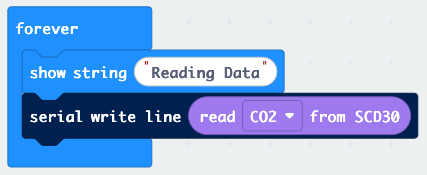

# Project Log

## Week of 12 January 2026 - Current

### Tasks:

- Project planning
    - [x]  Prepare using ipro introduction material
- Repository setup
    - [x]  Set up repository
    - [x]  Finish level 0 tasks up to [**Use a venv virtual environment with Python**]
- Learning IoT basics
    - [x]  Finish level 0 tasks up to [**Learn how to make a prototype**]
    - [ ]  Finish level 1 tasks up to [**Visualize data in a visual component**]
    - [ ]  Research indoor climate sensors
    - [ ]  Research microcontroller options
    - [ ]  Research communication protocols

### 13 January 2026

#### Setup Repository on Raspberry Pi
> Created new ssh key
>
> Added public key to gitlab
>
> Tried cloning repository to Raspberry Pi
>
> Failed. Connection Refused by gitlab.fhnw.ch
>
> Tried multiple possible solutions:
> - Checked ssh config file
> - Checked permissions of .ssh folder and files
> - Restarted ssh-agent
> - Verified ssh connection to gitlab.fhnw.ch
> - Verified gitlab account settings
> - Predefined ssh key for gitlab.fhnw.ch in ssh config
> - Tried different network (home vs. Mobile hotspot)
> - Searched online for similar issues
> - Tried using port 443 instead of 22
> - Ran verbose test with `ssh -vvv`
> ```console
> debug1: OpenSSH_10.0p2 Debian-7, OpenSSL 3.5.4 30 Sep 2025
> debug3: Running on Linux 6.12.62+rpt-rpi-v8 #1 SMP PREEMPT Debian 1:6.12.62-1+rpt1 (2025-12-18) aarch64
> debug3: Started with: ssh -vvv git@gitlab.fhwn.ch
> debug1: Reading configuration data /home/genavi/.ssh/config
> debug1: Reading configuration data /etc/ssh/ssh_config
> debug3: /etc/ssh/ssh_config line 19: Including file /etc/ssh/ssh_config.d/20-systemd-ssh-proxy.conf depth 0
> debug1: Reading configuration data /etc/ssh/ssh_config.d/20-systemd-ssh-proxy.conf
> debug1: /etc/ssh/ssh_config line 21: Applying options for *
> debug3: expanded UserKnownHostsFile '~/.ssh/known_hosts' -> '/home/genavi/.ssh/known_hosts'
> debug3: expanded UserKnownHostsFile '~/.ssh/known_hosts2' -> '/home/genavi/.ssh/known_hosts2'
> debug2: resolving "gitlab.fhwn.ch" port 22
> debug3: resolve_host: lookup gitlab.fhwn.ch:22
> debug3: channel_clear_timeouts: clearing
> debug3: ssh_connect_direct: entering
> debug1: Connecting to gitlab.fhwn.ch [147.86.2.81] port 22.
> debug3: set_sock_tos: set socket 3 IP_TOS 0x10
> debug1: Connection established.
> debug1: identity file /home/genavi/.ssh/id_ed25519_fhnw type 3
> debug1: identity file /home/genavi/.ssh/id_ed25519_fhnw-cert type -1
> key_exchange_identification: Connection closed by remote host
> Connection close by <ip > port 443
> ```
>
> Still no success.
>
> Switch to using Gitlabs Personal Access Token over HTTPS as workaround for now.


#### Setup Raspberry Pi OS on Raspberry Pi 3B+
> Followed instructions from [Raspberry Pi Documentation - Install Raspberry Pi OS using Raspberry Pi Imager](https://www.raspberrypi.com/documentation/computers/getting-started.html#install-raspberry-pi-os-using-raspberry-pi-imager)


### 12 January 2026

> ```console
> $ ls /dev/{tty,cu}.*
> /dev/cu.Bluetooth-Incoming-Port
> /dev/cu.usbmodem1102
> /dev/tty.debug-console
> /dev/tty.wlan-
> /dev/cu.debug-console
> /dev/cu.wlan-debug
> /dev/tty.MAJORIV
> /dev/cu.MAJORIV
> /dev/tty.Bluetooth-Incoming-Port
> /dev/tty.usbmodem1102
> ```

#### Read ASCII bytes from a serial port

> Reading using python successful.
> ```console
> (venv) $ pip uninstall serial
> (venv) $ pip install pyserial
> ```
> 
> ```python
> # ./level-1/Python/serial_read/serial_read.py
> import serial
> 
> port = serial.Serial('/dev/tty.usbmodem1102')
> port.baudrate = 115200
> while (port.isOpen()):
>     bytes = port.readline()
>     chars = str(bytes, 'utf-8')
>     print(chars)
> ```
> 
> ```console
> (venv) $ python level-1/Python/serial_read/serial_read.py$
> ```

> While trying to display CO2 values from the SCD30 sensor, encountered the following problem
>
> Problem while reading from serial port
> ```console
> $ screen /dev/tty.usbmodem1102 115200
> $TERM too long - sorry
> ```
>
> Solution: Was already running `screen` somewhere else. Closed all `screen` sessions from Activity Monitor > CPU and retried.
> ```console
> 1837.19738769531
> 1837.61218261719
> 1839.27307128906
> 1840.57336425781
> ...
> ```

#### Write ASCII bytes to a serial port

<kbd></kbd>

#### Prototype

<kbd></kbd>

#### venv
```console
$ cd templates/fhnw-ipro-indoor-climate-genavi/level-0
$ python3 -m venv venv
$ source venv/bin/activate
(venv) $ python --version
(venv) $ deactivate
$ rm -r venv
```

#### Repository setup

```console
$ git clone git@gitlab.fhnw.ch:david.ringgenberg/ipro-indoor-climate-project.git
$ git submodule add git@github.com:Genavi/fhnw-ipro-indoor-climate.git ./templates/fhnw-ipro-indoor-climate-genavi
$ git submodule add git@gitlab.fhnw.ch:david.ringgenberg/ipro_strat_hs25.git ./templates/ipro_strat_hs25
```