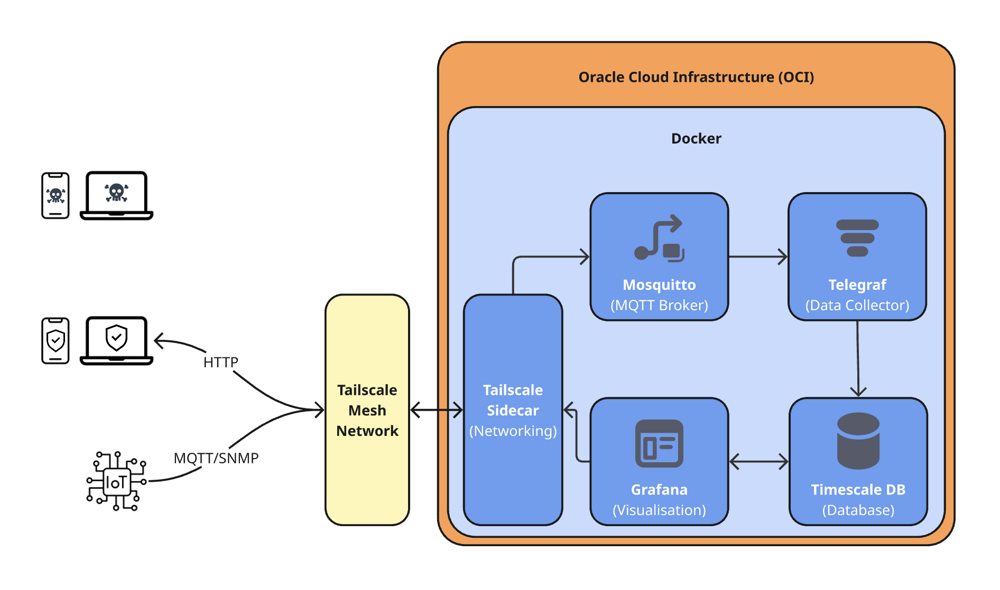
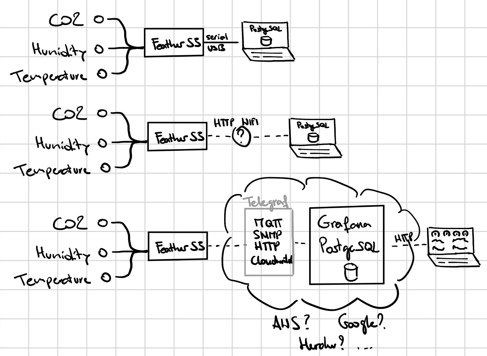
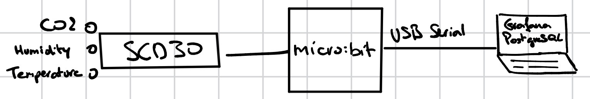

# Project Log

## Week of 19 January 2026

### Tasks:
- Learning Iot basics
    - [ ]  Finish level 3 tasks
- Learn Telegraf with [InfluxDB University](https://university.influxdata.com/):
    - [x]  Complete "Telegraf Basics" course
    - [ ]  ~~Complete "Data Collection with Telegraf" course~~ -> primarily focused on InfluxDB
    - [x]  Complete "Telegraf Administrator" course
- Project
    - [x]  Learn about Telegraf Basics and Data Collection
    - [ ]  Set up Cloud Solution for Data Storage and Visualization
    - [ ]  Set up secure networking with Tailscale
    - [ ]  Set up Mosquitto MQTT Broker
    - [ ]  Set up Telegraf to read data from FeatherS3 via MQTT/~~SNMP/HTTP~~
    - [ ]  Implement data ingestion from FeatherS3 to TimescaleDB
    - [ ]  Update Grafana dashboard to include FeatherS3 data
    - [ ]  Create unit tests for data ingestion and visualization components

### 21 January 2026
> Asked [Gemini](https://gemini.google.com/) for assistance in finding a cheap cloud solution for hosting TimescaleDB and Grafana.
>
> Query:
> ```markdown
> I want to be able to host multiple containers using docker-compose. Including Grafana OSS, PostgreSQL (TimescaleDB), Mosquitto, Telegraf. Help me decide if I should host this in the cloud or if there is an other way. It should be free of charge. Keep in mind, that I am a Computer Science student and might have academic prices
> ```
>
> Suggested Solutions:
> ```markdown
> Hosting a stack with Grafana, TimescaleDB, Mosquitto, and Telegraf is a classic "TIG" (Telegraf, Influx/Timescale, Grafana) monitoring stack. For a computer science student, you have two primary paths: the Cloud (using student credits) or Self-Hosting (on a local server or old laptop).
> 
> Given your requirement for it to be free of charge, here is the breakdown to help you decide.
> 
> Option 1: The "Always Free" Cloud (Recommended)
> Cloud providers offer "Always Free" tiers that are perfect for lightweight Docker Compose setups. Since you are a student, you have even better access.
> 
> 1. Oracle Cloud (Best for Resources)
> Oracle Cloud is widely considered the "gold standard" for free hosting.
> 
> The Perk: Their ARM-based Ampere A1 instances provide up to 4 OCPUs and 24 GB of RAM for free.
> 
> Why it fits: TimescaleDB (PostgreSQL) can be memory-intensive. Having 24GB of RAM is massive and will easily handle your entire stack.
> 
> Catch: Availability can be tight in some regions. You may need to wait for a slot to open.
> 
> 2. GitHub Student Developer Pack (Best for Variety)
> As a CS student, you should definitely sign up for this. It bundles several offers:
> 
> DigitalOcean: Usually includes $200 in credit (valid for 1 year). You can spin up a "Droplet" (VM), install Docker, and run your stack.
> 
> Microsoft Azure for Students: $100 annual credit + many free services (B1s VMs are often free for 12 months).
> 
> Heroku: Includes credits for students, though hosting a persistent database like TimescaleDB is trickier there than on a standard VM.
> 
> Option 2: The "Old Laptop" Way (Self-Hosting)
> If you have an old laptop or a Raspberry Pi lying around, this is the most "authentic" CS experience.
> 
> Pros: Zero cost (besides a few cents of electricity), total privacy, and no "credit expiration" anxiety. It also teaches you about networking (Port Forwarding, Dynamic DNS).
> 
> Cons: If your home internet goes down, your dashboard goes down. You have to manage the hardware yourself.
>
> My Recommendation
> Start with Oracle Cloud. 1. Apply for the Oracle Cloud Always Free tier. 2. Create a VM.Standard.A1.Flex instance (ARM). 3. Install Docker and Docker Compose. 4. If Oracle is unavailable in your region, use the DigitalOcean $200 credit from the GitHub Student Pack to get running immediately.
> ```

> Created a Oracle Cloud account with the "Free Tier" option.
> -> Status: Pending approval by Oracle.
> 

> Planned project architecture with:
> - [Oracle Cloud Infrastructure (OCI)](https://www.oracle.com/cloud/free/) as cloud provider
> - [Tailscale](https://tailscale.com/) for secure networking
> - [Mosquitto](https://mosquitto.org/) as MQTT broker
> - [Telegraf](https://www.influxdata.com/time-series-platform/telegraf/) as data collector
> - [TimescaleDB](https://www.timescale.com/) (Postgres) as time-series database
> - [Grafana](https://grafana.com/) for data visualization
>
> <kbd></kbd>
>
> Miro link to the architecture diagram: [Miro - fhnw-ipro-indoor-climate](https://miro.com/app/board/uXjVGSZSySg=/?share_link_id=434076462743)
>
> <i>Icons from:</i>
> - [Laptop Icon](https://www.flaticon.com/authors/those-icons)
> - [Smartphone Icon](https://www.flaticon.com/authors/good-ware)
> - [IoT Device Icon](https://www.flaticon.com/authors/hajicon)
> - [Danger Icon](https://www.flaticon.com/authors/popcic)
> - [Security Icon](https://www.flaticon.com/authors/ilham-fitrotul-hayat)

> Started setting up [docker-compose.yml](../../docker-compose.yml) for cloud deployment based on existing local development setup.
>
> Added Tailscale, Mosquitto, Telegraf services.
> - Because Tailscale handles secure networking, I removed the exposed ports for Mosquitto, Telegraf, Postgres and Grafana.
>
> Add netork iot_net for inter-container communication
> 
> Updated volume mounts to use named volumes instead of bind mounts for persistent data storage.
> - Mosquitto data and log volumes
> - Tailscale state volume
> - Grafana data volume
> - Postgres data volume
>
> Updated Volume names to properly reflect their purpose.
> - 'pgdata' -> 'postgres_data'
> - 'grafana-storage' -> 'grafana_data'


### 20 January 2026
> Finished "Telegraf Basics" course on InfluxDB University.

> Researched Telegraf input plugins for FeatherS3 data collection:
> - MQTT Consumer Plugin
> - SNMP Input Plugin
> - HTTP Listener Plugin
> Decided to start with MQTT Consumer Plugin due to FeatherS3's built-in MQTT support.
> Learned from the documentation how to configure Telegraf with MQTT Consumer Plugin.
> ```toml
> [[inputs.mqtt_consumer]]
>   servers = ["tcp://<FEATHERS3_IP>:1883"]
>   topics = ["sensors/indoor_climate"]
>   qos = 0
>   client_id = "telegraf_feathers3_client"
>   data_format = "json"
> ```
>
> Because I decided to use MQTT as communication protocol between FeatherS3 and Telegraf, I set up Mosquitto MQTT broker using Docker.
> ```yaml
> mosquitto:
>   image: eclipse-mosquitto:latest
>   container_name: mosquitto
>   restart: unless-stopped
>   volumes:
>     - ./mosquitto/config/mosquitto.conf:/mosquitto/config/mosquitto.conf
>     - ./mosquitto/data:/mosquitto/data
>     - ./mosquitto/log:/mosquitto/log
>   networks:
>     - iot_net
> ```
>

> While browsing [dev.to](https://dev.to/) for Raspberry Pi related articles, found this great article on setting up a HomeLab Gateway with Tailscale and Raspberry Pi: [tailscale-raspberry-pi-homelab-gateway-4fin](https://dev.to/neelp03/tailscale-raspberry-pi-homelab-gateway-4fin)
>
> I like the idea of using Tailscale for secure remote access to the IoT Gateway. Might implement this in the project later on.

### 19 January 2026

> <kbd></kbd>
>
> Connected FeatherS3 to Macbook via USB-C cable
>
> Loaded SCD30 CircuitPython library onto FeatherS3
> 
> Wrote CircuitPython script to read SCD30 sensor data and output via serial
> ```python
> # CIRCUITPY/code.py
> import adafruit_scd30
> import board
> import time
> 
> sensor = adafruit_scd30.SCD30(board.I2C())
> 
> while True:
>     try:
>         co2 = sensor.CO2
>         temperature = sensor.temperature
>         fahrenheit = temperature * 9 / 5 + 32
>         celcius = temperature
>         humidity = sensor.relative_humidity
>         print(f"CO2: {co2} ppm, Temperature: {temperature} °C, {fahrenheit} °F, Humidity: {humidity} %")
>     except Exception as e:
>         print(f"Error reading sensor data: {e}")
>     time.sleep(5)
> ```
>
> Verified SCD30 sensor readings over serial using `screen`
> ```console
> $ screen /dev/tty.usbmodem4F21AF143F891 115200
> Auto-reload is on. Simply save files over USB to run them or enter REPL to disable.
> code.py output:
> Hello World!
> CO2: 1187.78 ppm, Temperature: 22.7169 °C, 72.8904 °F, Humidity: 50.7629 %
> CO2: 1187.71 ppm, Temperature: 22.7569 °C, 72.9625 °F, Humidity: 50.676 %
> CO2: 1186.65 ppm, Temperature: 22.7569 °C, 72.9625 °F, Humidity: 50.6042 %
> CO2: 1187.48 ppm, Temperature: 22.7863 °C, 73.0153 °F, Humidity: 50.5844 %
> CO2: 1187.94 ppm, Temperature: 22.7997 °C, 73.0394 °F, Humidity: 50.5402 %
> CO2: 1187.86 ppm, Temperature: 22.8424 °C, 73.1163 °F, Humidity: 50.4303 %
> CO2: 1187.77 ppm, Temperature: 22.8424 °C, 73.1163 °F, Humidity: 50.3479 %
> ...

> Started learning Telegraf with InfluxDB University. Learning path [Learnings - Telegraf](../3-learnings/telegraf.md)

## Week of 12 January 2026

### Tasks:

- Project planning
    - [x]  Prepare using ipro introduction material
- Repository setup
    - [x]  Set up repository
    - [x]  Finish level 0 tasks up to [**Use a venv virtual environment with Python**]
- Learning IoT basics
    - [x]  Finish level 0 tasks up to [**Learn how to make a prototype**]
    - [x]  Finish level 1 tasks up to [**Visualize data in a visual component**]
    - [x]  Research indoor climate sensors
    - [x]  Research microcontroller options
    - [x]  Research communication protocols

### 16 January 2026

> setup .env, docker-compose-override.yml for local development
>
> updated documentation for setting up the development environment
>
> learning to set up alembic for database migrations (reason: https://dev.to/vivekthedev/effortless-database-migrations-why-alembic-is-your-python-must-have-2f0n)
> - Tutorial to [Alembic](https://alembic.sqlalchemy.org/en/latest/tutorial.html#)
> - Documentation to [SQLAlchemy](https://docs.sqlalchemy.org/en/20/tutorial/index.html)
>
> updating project repository to a more modular structure to keep the repository from getting too cluttered

> continued working on setting up the project repository
>
> initialized alembic project
> ```console
> $ alembic init migrations
> ```
>
> created database models based on excisting database schema
>
> created initial alembic migration script to set up database schema
> ```console
> $ alembic revision --autogenerate -m "initial migration"
> $ alembic upgrade head
> ```
>
> implemented serial reader to read data from micro:bit over serial USB connection
>
> implemented data parsing and saving to TimescaleDB using SQLAlchemy ORM
>
> 

### 15 January 2026

> little personal Side-Quest:
> setup Texas Instruments MSP430 microcontroller with VSCode/PlatformIO on macOS
>
> tested OLED Display, 4-Digit Display with MSP430 board
> - had trouble getting the OLED Display to display properly.
> - found out that the library I used (U8g2) was not meant for my OLED display. Switched to U8x8 library which worked fine.
>
> wasn't able to get the 4-Digit Display to work. Suspect chip issue. Tried multiple wiring setups and different libraries without success.
> - when trying to check analog ports using a simple Button sensor script, the readings were all over the place.
> - when trying to check if the port, connected to the button, was getting power, it showed another port (not connected to anything) getting power instead.
> - when checking the pins, I noticed the GND pin was slightly nicked. Which could explain the faulty power communication.

> <kbd></kbd>
>
> setup Grafana (OSS) using docker-compose using the following resources:
> - https://grafana.com/docs/grafana/latest/setup-grafana/installation/docker/#run-grafana-via-docker-compose
> - https://grafana.com/docs/grafana/latest/setup-grafana/installation/docker/#save-your-grafana-data-1
>
> setup timescaledb using docker-compose
>
> implement basic data ingestion from micro:bit to timescaledb
>
> setup a grafana dashboard to visualize data from timescaledb
>
> let it run for a few hours to collect some data points
>
> <kbd></kbd>

### 13 January 2026

#### Setup Repository on Raspberry Pi
> Created new ssh key
>
> Added public key to gitlab
>
> Tried cloning repository to Raspberry Pi
>
> Failed. Connection Refused by gitlab.fhnw.ch
>
> Tried multiple possible solutions:
> - Checked ssh config file
> - Checked permissions of .ssh folder and files
> - Restarted ssh-agent
> - Verified ssh connection to gitlab.fhnw.ch
> - Verified gitlab account settings
> - Predefined ssh key for gitlab.fhnw.ch in ssh config
> - Tried different network (home vs. Mobile hotspot)
> - Searched online for similar issues
> - Tried using port 443 instead of 22
> - Ran verbose test with `ssh -vvv`
> ```console
> debug1: OpenSSH_10.0p2 Debian-7, OpenSSL 3.5.4 30 Sep 2025
> debug3: Running on Linux 6.12.62+rpt-rpi-v8 #1 SMP PREEMPT Debian 1:6.12.62-1+rpt1 (2025-12-18) aarch64
> debug3: Started with: ssh -vvv git@gitlab.fhwn.ch
> debug1: Reading configuration data /home/genavi/.ssh/config
> debug1: Reading configuration data /etc/ssh/ssh_config
> debug3: /etc/ssh/ssh_config line 19: Including file /etc/ssh/ssh_config.d/20-systemd-ssh-proxy.conf depth 0
> debug1: Reading configuration data /etc/ssh/ssh_config.d/20-systemd-ssh-proxy.conf
> debug1: /etc/ssh/ssh_config line 21: Applying options for *
> debug3: expanded UserKnownHostsFile '~/.ssh/known_hosts' -> '/home/genavi/.ssh/known_hosts'
> debug3: expanded UserKnownHostsFile '~/.ssh/known_hosts2' -> '/home/genavi/.ssh/known_hosts2'
> debug2: resolving "gitlab.fhwn.ch" port 22
> debug3: resolve_host: lookup gitlab.fhwn.ch:22
> debug3: channel_clear_timeouts: clearing
> debug3: ssh_connect_direct: entering
> debug1: Connecting to gitlab.fhwn.ch [147.86.2.81] port 22.
> debug3: set_sock_tos: set socket 3 IP_TOS 0x10
> debug1: Connection established.
> debug1: identity file /home/genavi/.ssh/id_ed25519_fhnw type 3
> debug1: identity file /home/genavi/.ssh/id_ed25519_fhnw-cert type -1
> key_exchange_identification: Connection closed by remote host
> Connection close by <ip > port 443
> ```
>
> Still no success.
>
> Switch to using Gitlabs Personal Access Token over HTTPS as workaround for now.


#### Setup Raspberry Pi OS on Raspberry Pi 3B+
> Followed instructions from [Raspberry Pi Documentation - Install Raspberry Pi OS using Raspberry Pi Imager](https://www.raspberrypi.com/documentation/computers/getting-started.html#install-raspberry-pi-os-using-raspberry-pi-imager)


### 12 January 2026

> ```console
> $ ls /dev/{tty,cu}.*
> /dev/cu.Bluetooth-Incoming-Port
> /dev/cu.usbmodem1102
> /dev/tty.debug-console
> /dev/tty.wlan-
> /dev/cu.debug-console
> /dev/cu.wlan-debug
> /dev/tty.MAJORIV
> /dev/cu.MAJORIV
> /dev/tty.Bluetooth-Incoming-Port
> /dev/tty.usbmodem1102
> ```

#### Read ASCII bytes from a serial port

> While trying to display CO2 values from the SCD30 sensor, encountered the following problem
>
> Problem while reading from serial port
> ```console
> $ screen /dev/tty.usbmodem1102 115200
> $TERM too long - sorry
> ```
>
> Solution: Was already running `screen` somewhere else. Closed all `screen` sessions from Activity Monitor > CPU and retried.
> ```console
> 1837.19738769531
> 1837.61218261719
> 1839.27307128906
> 1840.57336425781
> ...
> ```

> Reading using python successful.
> ```console
> (venv) $ pip uninstall serial
> (venv) $ pip install pyserial
> ```
> 
> ```python
> # ./level-1/Python/serial_read/serial_read.py
> import serial
> 
> port = serial.Serial('/dev/tty.usbmodem1102')
> port.baudrate = 115200
> while (port.isOpen()):
>     bytes = port.readline()
>     chars = str(bytes, 'utf-8')
>     print(chars)
> ```
> 
> ```console
> (venv) $ python level-1/Python/serial_read/serial_read.py$
> ```

#### Write ASCII bytes to a serial port

<kbd></kbd>

#### Prototype

<kbd></kbd>
#### venv
```console
$ cd templates/fhnw-ipro-indoor-climate-genavi/level-0
$ python3 -m venv venv
$ source venv/bin/activate
(venv) $ python --version
(venv) $ deactivate
$ rm -r venv
```

#### Repository setup

```console
$ git clone git@gitlab.fhnw.ch:david.ringgenberg/ipro-indoor-climate-project.git
$ git submodule add git@github.com:Genavi/fhnw-ipro-indoor-climate.git ./templates/fhnw-ipro-indoor-climate-genavi
$ git submodule add git@gitlab.fhnw.ch:david.ringgenberg/ipro_strat_hs25.git ./templates/ipro_strat_hs25
```