# Telegraf Learnings

Courses to learn Telegraf from [InfluxDB University](https://university.influxdata.com/).
| Course Name | 
|--------|
| [Telegraf Basics](https://university.influxdata.com/learn/courses/4/telegraf-basics) |
| [Data Collection with Telegraf](https://university.influxdata.com/learn/learning-plans/2/data-collection-with-telegraf) |
| [Telegraf Administrator](https://university.influxdata.com/learn/courses/5/telegraf-administrator) |

- [Telegraf Basics](#telegraf-basics)
    - Module 1
        - [Telegraf Agent: Core functionality](#telegraf-agent-core-functionality)
        - [Telegraf Plugin Types](#telegraf-plugin-types)
        - [Telegraf Best Practices](#telegraf-best-practices)
        - [Telegraf Configuration](#telegraf-configuration)
    - Module 2
        - [Writing Telegraf Plugin](#writing-telegraf-plugin)
        - [Input Plugin Requirements](#input-plugin-requirements)
        - [Output Plugin Requirements](#output-plugin-requirements)
        - [Processor & Aggregator Plugin Requirements](#processor--aggregator-plugin-requirements)
        - [Using the ExecD Plugin](#using-the-execd-plugin)
    - [Data Collection with Telegraf](#data-collection-with-telegraf)
- [Telegraf Administrator](#telegraf-administrator)

## Telegraf Basics

<kbd>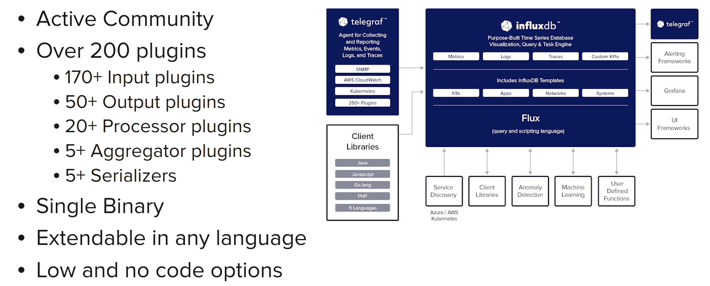</kbd>

Written in [Go](https://golang.org/), open source, plugin-driven server agent for collecting and reporting metrics.

Supported for Linux, Windows, macOS, and more.

Config in single TOML file.

### Telegraf Agent: Core functionality

<kbd>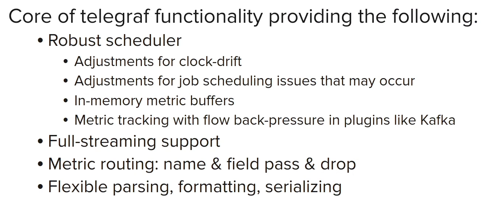</kbd>

Agent communication Block defines how Telegraf fetches, batches and flusches data.

Scheduler for pulling data at specified intervals.

In-Memory metric buffer. If downstream database is temorarily unavailable, metrics are stored in memory until they can be written.

Event-based plugins send data based on an event. Streaming allows for events to take all metrics, stream to all processes, and allow for multiple metrics to be sent at a time, done in parallel, to get high throughput.

Metric router to allow to configure how metrics are processed (drop, pass or other action) and where they are sent. Pass or drop metrics based on name, field or tag.

Flexible parsing including support for JSON, CSV, Graphite, and more.

### Telegraf Plugin Types

<kbd>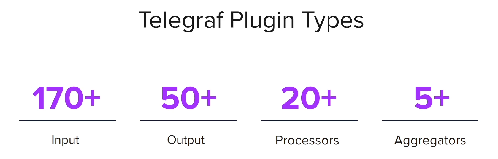</kbd>

<kdb>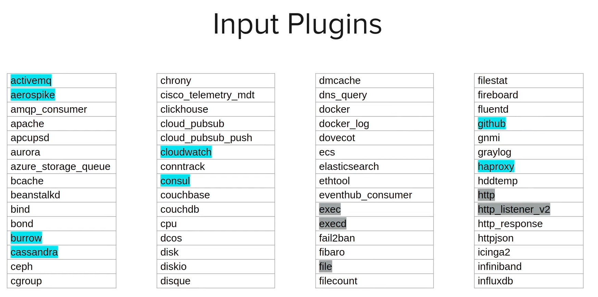</kbd>

Input Plugins: Collect metrics from the system, services, and third-party APIs. Over 200 input plugins available.

Metrics from:
- common open source data infrastructure tools: MySQL, Cassandra, Redis, MongoDB, and more.
- common DevOps tools and frameworks: Jenkins, GitHub, NGINX, HA Proxy, Kubernetes, and more.
- common Monitoring Systems: CloudWatch, Prometheus, Google Monitoring, and more.
- low-level sysytem telemetry: IP Tables, Linux CCL file system, netstat, and more.

<kbd>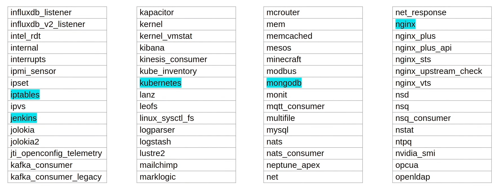</kbd>

Ingest from many generic data sources:
- contents of entire file or tail the end of a file
- socker listener for TCP, UDP
- HTTP Listener to receive posts over HTTP
- HTTP Poller to poll HTTP endpoints
- exec to run custom scripts or commands and get metrics from standard out and execd to execute a demonized process

<kbd>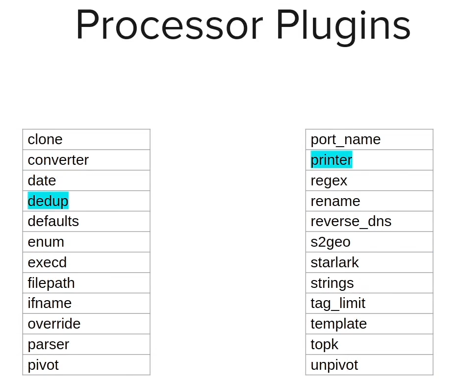</kbd>

Transform, decorate or filter metrics as they pass through Telegraf. Over 20 processor plugins available.
- dedupe: Remove duplicate metrics based on specified tag and field values.
- printer: Print metrics to standard out, useful for debugging.

<kbd>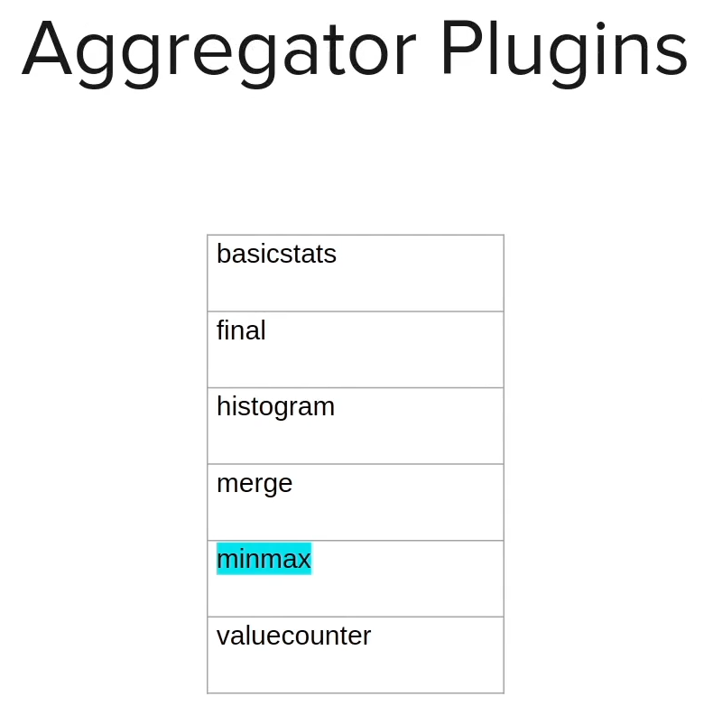</kbd>

Create aggregate metrics data collected over a period of time.
- minmax: Track the minimum and maximum values of a field over a time period.

<kbd>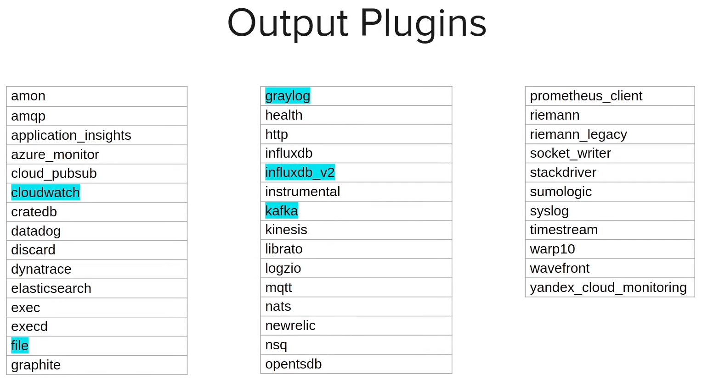</kbd>

Write metrics to various destinations. You can specify multiple outputs to dual write data.
- influxdb_v2: Write metrics to InfluxDB v2.x HTTP service
- cloudwatch, graylog, kafka, and more.

<kbd>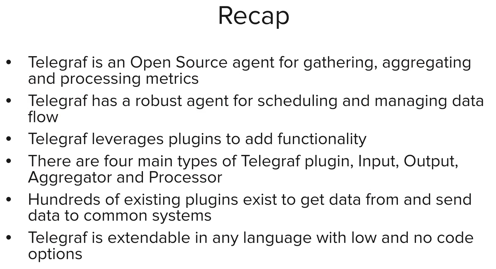</kbd>

### Telegraf Best Practices

<kbd>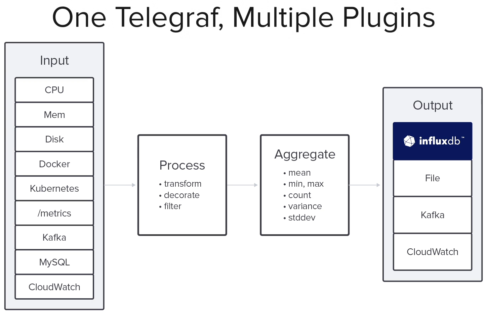</kbd>

Common architectures:
- Single Telegraf instance collecting from multiple sources and writing to a single destination.

    <kbd></kbd>

- Multiple Telegraf instances collecting from multiple sources and writing to a Message Queue (Can be Kafka, Rabbit, Active, etc.).

    <kbd>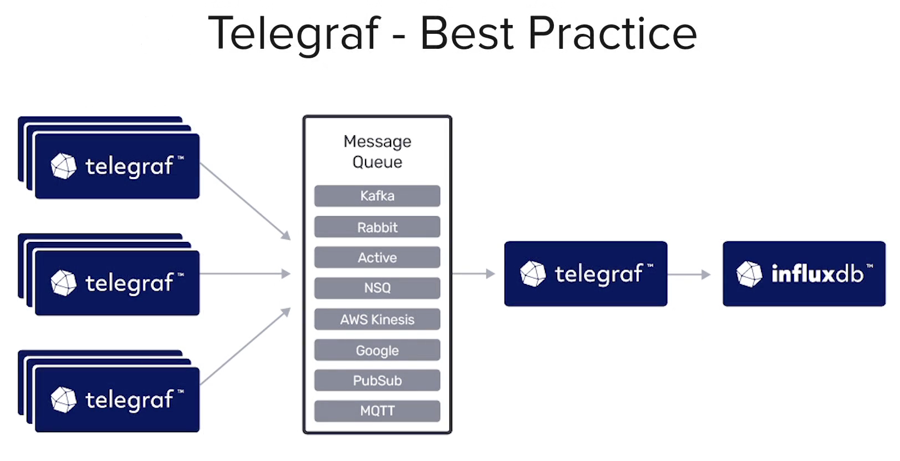</kbd>

- Thousands of Telegraf instances collecting from multiple sources and writing to only a couple of telegraf instances that then write to the destination.

    <kbd>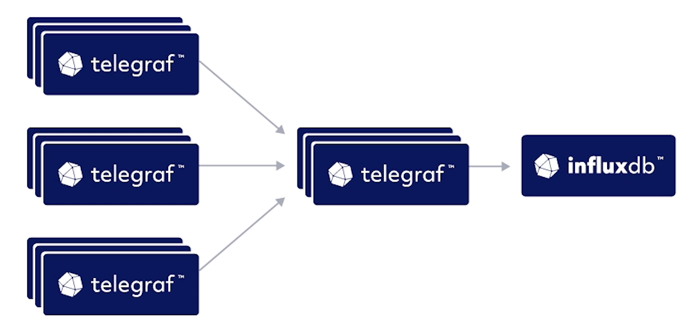</kbd>

### Telegraf Configuration

<kbd>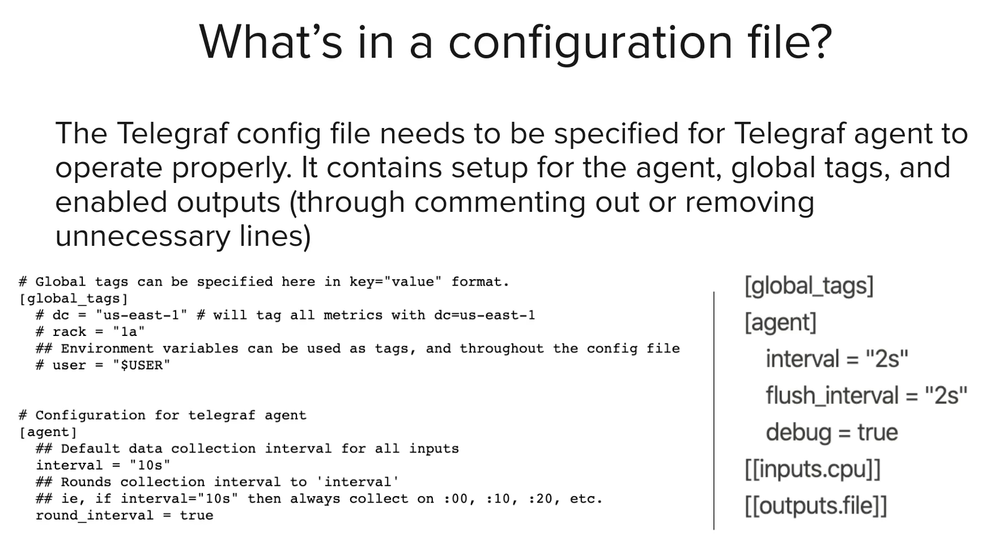</kbd>

On Telegraf startup, a config file needs to be provided. If none is provided, a default config file is generated. 
- On the left: default shipping config file including global tags
- On the right: Same config but without the tags

Both work

<kbd>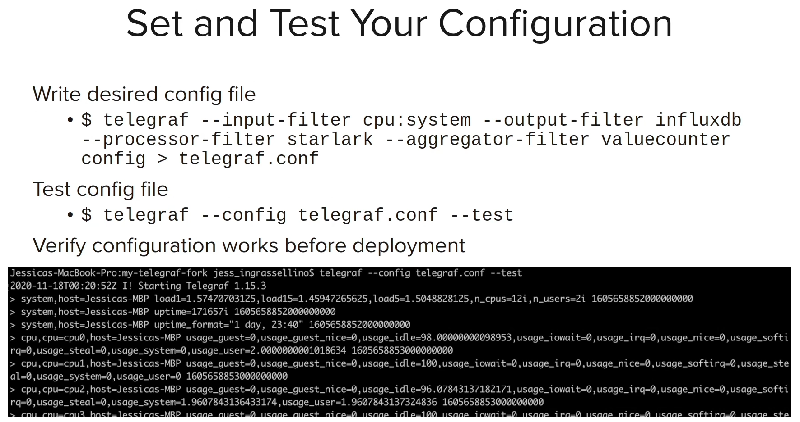</kbd>

<kbd>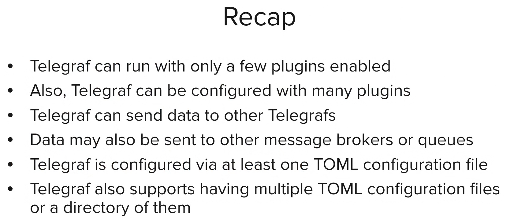</kbd>

### Writing Telegraf Plugin
...

### Input Plugin Requirements
...

### Output Plugin Requirements
...

### Processor & Aggregator Plugin Requirements
...

### Using the ExecD Plugin
...

## Data Collection with Telegraf
...

## Telegraf Administrator
...